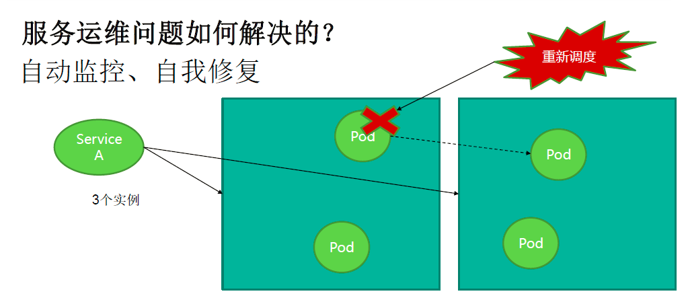
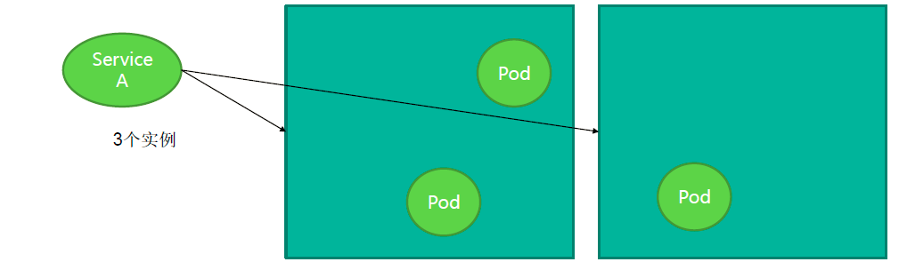

## 传统的分布式架构

1. 各种服务之间可能会相互调用
2. 使用服务注册表寻址

## kubernetes分布式架构

1. 每个服务相当于一台电脑，为其分配一个不变的虚拟IP+端口
2. 在ENV环境变量中存放每个服务的服务名称到IP的映射
3. 每个结点上都有一个软件实现的服务代理来实现负载均衡
  
4. 如果一个结点上的pod宕机了，则其会自动在另外一个结点上重启一个系统的pod。这一点要求我们的服务是无状态的，即配置文件不能写在服务中。
  
5. 我们只需要确定需要部署的实例数目，系统会自动完成调度工作。在下面的例子中，我们开了3个A服务
  

## 一个例子

1. 前端由PHP实现
2. 一个redis-master，两个redis-slave
3. 前端向redis-master中写入数据，redis-slave从redis-master中赋值数据，保持一致。
4. 前端从redis-slave中读数据

