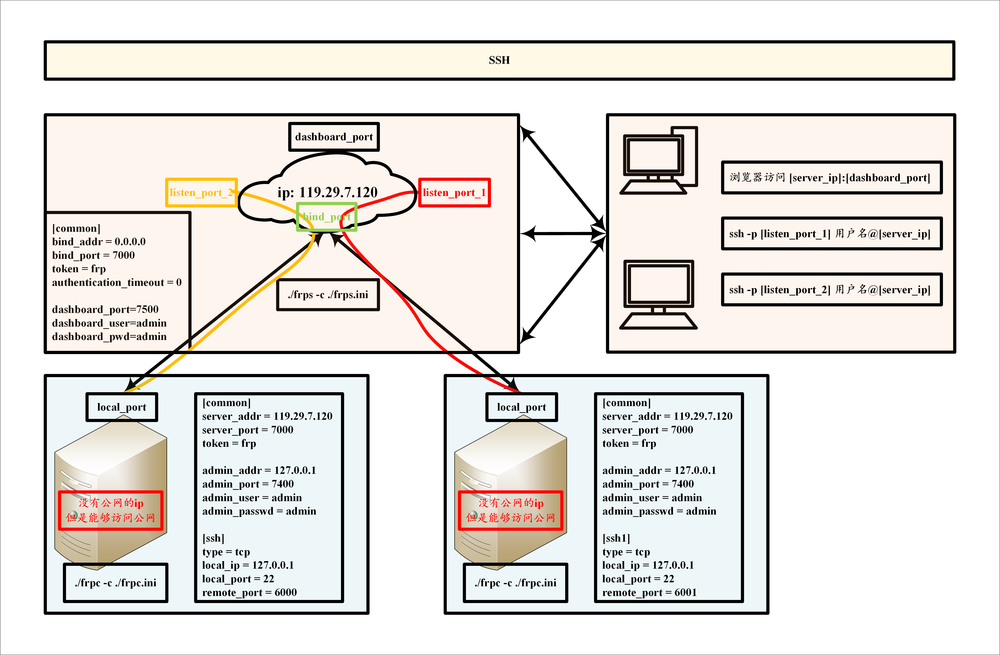

> FRP 全名：Fast Reverse Proxy。FRP 是一个使用 Go 语言开发的高性能的反向代理应用，可以帮助您轻松地进行内网穿透，对外网提供服务。FRP 支持 TCP、UDP、HTTP、HTTPS等协议类型，并且支持 Web 服务根据域名进行路由转发。
> 


# SSH服务





## frpc.ini

```ini
[common]
server_addr = 119.29.7.120
server_port = 7000
auto_token = frp

[ssh4]
type = tcp
local_ip = 127.0.0.1
local_port = 22
remote_port = 6000
```


```bash
# 赋予执行权限
chmod a+x frpc
# 启动客户端
./frpc -c frpc.ini
```

## frps.ini

```ini
[common]
bind_addr = 0.0.0.0
bind_port=7000

[ssh4]
listen_port = 6000
auto_token = frp
```

```bash
# 赋予执行权限
chmod a+x frps
# 启动客户端
./frps -c frps.ini
```


# http服务

> 应用场景：有时，我们想要将本地的、在NAT网络后面的web服务暴露，以便用您自己的域名进行测试，不幸的是，我们无法将一个域名解析为本地ip。
但是，我们可以使用frp公开http或https服务。

## frpc.ini

```ini
# frpc.ini
[common]
server_addr = 47.93.28.169
server_port = 7000

[web]
type = http
local_port = 80
custom_domains = www.yourdomain.com
```

## frps.ini

```ini
[common] 
bind_port = 7000
vhost_http_port = 8080
```


# 参考文献

https://segmentfault.com/a/1190000009895225#articleHeader2